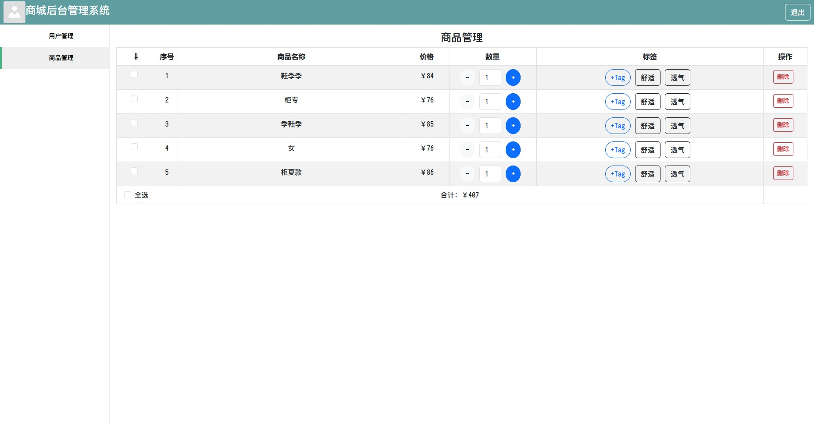

# Tech

This project uses Bun.js as the rendering engine, and the technology stack includes Vue, Mock.js, and bootstrap.css.

# Usage

To run this project, make sure you have Node.js or Bun.js runtime environment installed on your machine.

Run the following command:

```bash
bun install
bun run dev
```

If you are using Node.js, the following commands are recommended:

```bash
npm install
npm run dev
```

This will install the necessary dependencies and start the development server.

# Preview


