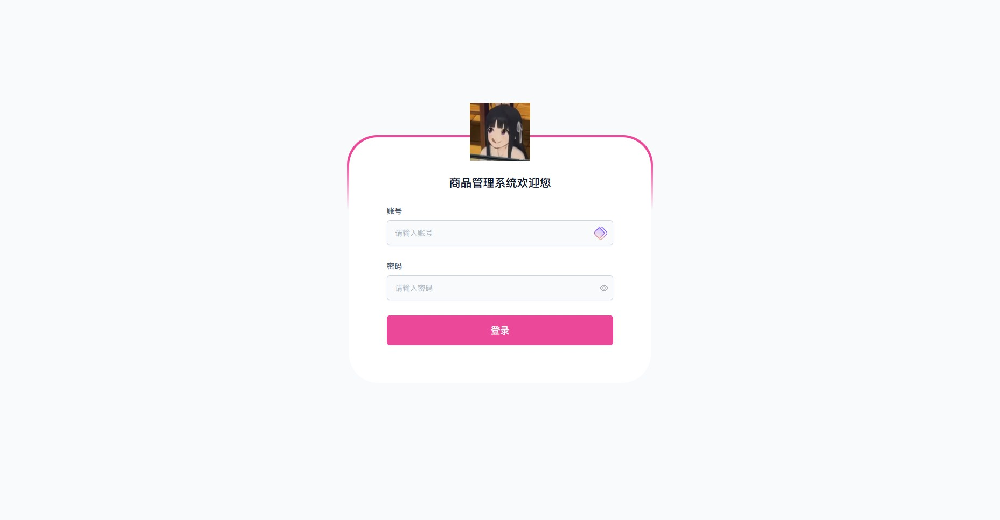
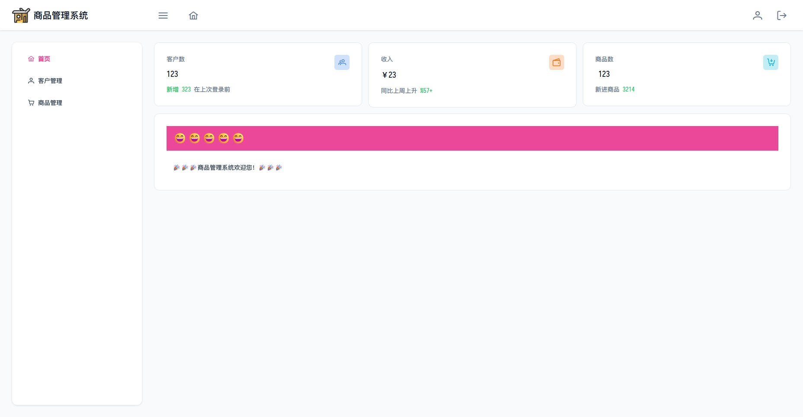
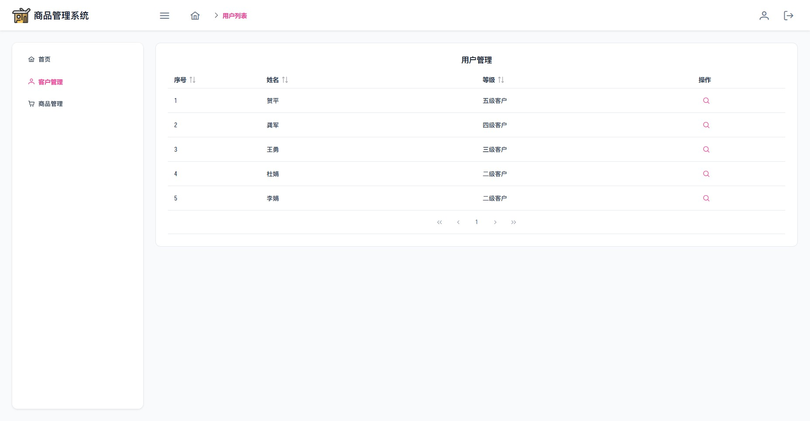
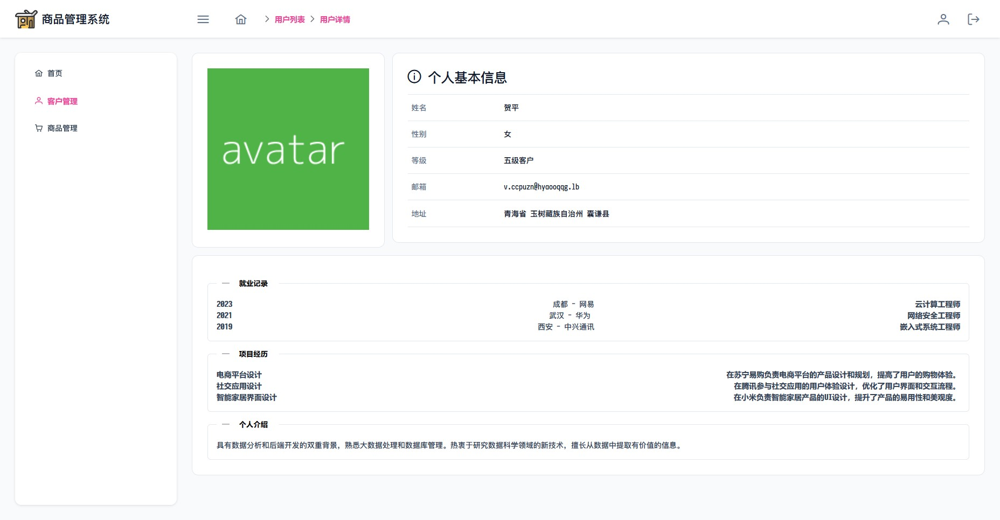
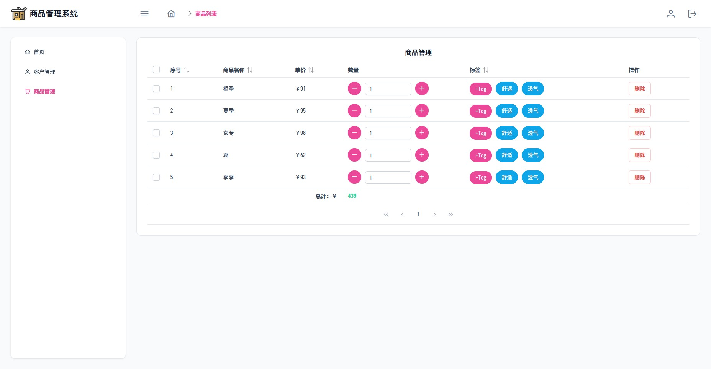

# 项目技术栈

本项目基于 Vue3 和 Vite 构建，采用 Pinia 进行全局状态管理，使用 Mock.js 模拟后端 API。项目的 UI 框架为 PrimeVue v4，路由管理由 vue-router 负责，axios 用于处理 HTTP 请求。

# 部署指南

本项目在开发过程中使用 bun.js 作为运行时环境，但也支持使用 Node.js 运行。在两种环境下的测试均表现正常。

如果您选择使用 bun.js，首先请确保 bun.js 已正确安装在您的环境中，然后在项目根目录执行以下命令：

```bash
bun install
bun run dev
```

如果您选择使用 Node.js，同样在项目根目录执行以下命令：

```bash
npm install
npm run dev
```

# 预览

## 登录页面

主要功能包括：

-   表单校验：确保用户输入的数据格式正确。
-   登录请求：使用 axios 发送登录请求。



## 首页

主要功能包括：

-   侧边栏：提供导航功能，方便用户快速找到所需页面。
-   面包屑导航：显示当前页面在整个网站结构中的位置，帮助用户理解其上下文关系。
-   个人信息操作菜单：用户可以查看和修改个人信息。
-   退出登录：用户可以安全地退出当前账户。



## 用户列表

只是一个表格加上详情查看，展示内容做成大概个人简历的模式。





## 商品列表

主要功能包括：

-   多选：用户可以选择多个商品。
-   总价实时更新：根据用户选择的商品，总价会实时更新。
-   删除功能：用户可以删除选中的商品。


